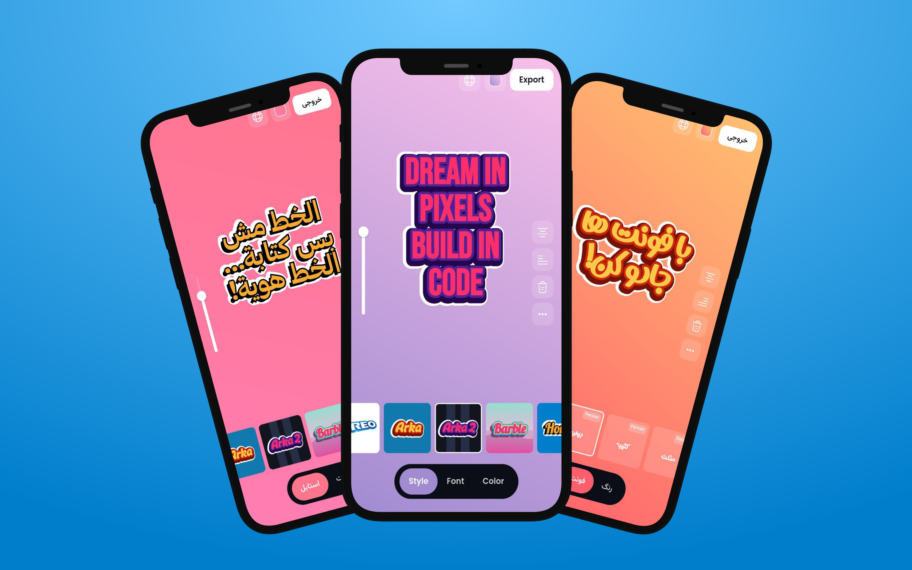

# ✨ FontStory App

**FontStory** is a fantasy-powered, open-source Flutter app that lets you create, remix, and share beautifully styled text using layered effects and custom fonts — all powered by simple JSON.

<p align="center">
  
</p>

<p align="center">
  <a href="https://flutter.dev">
    
  </a>
  <a href="https://github.com/FontStory/font-story-app/releases">
    
  </a>
  <a href="https://github.com/FontStory/font-story-app/issues">
    
  </a>
  <a href="https://github.com/FontStory/font-story-app/stargazers">
    
  </a>
</p>

## 📲 Try FontStory

| Platform       | Link                                                                 |
|----------------|----------------------------------------------------------------------|
| 📦 Google Play  | [Google Play](https://play.google.com/store/apps/details?id=com.studio.moon.font_story&pcampaignid=web_share) |
| 📁 APK         | [Download Latest APK](https://github.com/FontStory/font-story-app/releases/latest/download/app-release.apk) |
| 🌐 Web         | [Coming Soon](#)                        |


> No account. No ads. Just pure, creative fun — online or offline.

## ⚙️ Features

- 🖋️ **Custom Fonts** – Browse or contribute your own fonts (TTF, OTF)
- 🎨 **Layered Styling** – Combine shadows, strokes, and effects
- 🌈 **Visual Themes** – Swap colors and gradients easily
- 🧃 **JSON-Powered** – Styles defined entirely in editable JSON
- 🔁 **Import / Export** – Share styles with friends or the community
- 💖 **Community Friendly** – Easy to contribute fonts or styles
- 🔓 **100% Open Source** – No closed data or limits

## 🚀 Getting Started

### 🔧 Prerequisites

- [Flutter SDK](https://docs.flutter.dev/get-started/install)
- Dart >= 3.0
- Android Studio or VS Code (recommended)

### 📦 Installation

Clone the repository and run the app:

```bash
git clone https://github.com/FontStory/font-story-app.git
cd font-story-app
flutter pub get
flutter run
```

## 🔐 Environment Variables

Font Story supports optional AdMob integration for rewarded ads. The app loads these settings securely using [`flutter_dotenv`](https://pub.dev/packages/flutter_dotenv).

### 📄 `.env` Example

If you want to enable rewarded ads, create a `.env` file by copying the sample:

```bash
cp .env.sample .env
```

Then fill in your rewarded ad unit ID and ad toggle:

```
# .env

REWARDED_AD_ID=your-admob-rewarded_id
NO_ADS=false
```

> ⚠️ If you don’t want ads, set `NO_ADS=true`.  
> ✅ The app skips ad code if ads are disabled.

Also, ensure `.env` is added to `.gitignore` to avoid committing secrets:

```gitignore
.env
```


## 📱 Platform Support

Font Story is built and optimized for **mobile**:

- ✅ **Android** (device or emulator)
- 🌐 **Web** – Usable in **mobile view** only

Other platforms are **not officially supported**, but you can still run the app for development or experimentation:

- 🧪 **iOS** (macOS required for build)
- 🖥️ **macOS**, **Linux**, and **Windows** (via Flutter desktop)

> ⚠️ These platforms may have UI/UX issues or limited compatibility.


## 📁 App Structure

```bash
lib/                         # All Dart source code
├── app.dart                 # Root app widget
├── main.dart                # App's entry point
├── splash.dart              # Initial loading screen
│
├── config/                  # App configuration files
│   ├── routes/              # Navigation and routing logic
│   ├── themes/              # App themes and visual styles
│   └── values/              # Static values
│
├── core/                    # Shared code for all features
│   ├── common/              # Common utilities and models
│   ├── components/          # Shared, reusable UI widgets
│   ├── constants/           # App-wide constants
│   ├── error/               # Custom error and failure handling
│   ├── extensions/          # Dart extension methods
│   ├── helpers/             # Helper functions and classes
│   ├── services/            # Abstract service contracts/interfaces
│   └── usecase/             # Core business logic units
│
├── features/                # Contains all feature modules.
│   └── font_story/          # The "Font Story" feature module
│       ├── data/            # Data layer 
│       ├── domain/          # Domain layer 
│       └── presentation/    # Presentation layer
│
└── locator/                 # Dependency injection setup
```

## 📦 Dependencies & Packages

This Flutter app, **FontStory**, uses a wide range of packages to provide powerful features, localization, networking, state management, UI components, and more.

### 🛠 Core Dependencies

| Package              | Purpose                                                   |
|----------------------|-----------------------------------------------------------|
| `flutter`            | Flutter SDK core                                          |
| `easy_localization`  | Internationalization and localization support             |
| `dio`                | Powerful HTTP client for REST API calls                   |
| `flutter_dotenv`     | Load environment variables from `.env` files             |
| `get_it`             | Dependency injection container                            |
| `injectable`         | Code generation for dependency injection                  |
| `logger`             | Advanced logging utility                                  |
| `dartz`              | Functional programming utilities                           |
| `isolate_manager`    | Manage Dart isolates for heavy computation                |
| `equatable`          | Simplify value equality                                   |
| `bloc` & `flutter_bloc` | State management based on BLoC pattern                  |
| `skeletonizer`       | Skeleton loading animations                               |
| `loading_animation_widget` | Pre-built loading animations                            |
| `cached_network_image` | Efficient image caching and displaying                   |
| `flutter_colorpicker` | Color picker widgets                                      |
| `screenshot`         | Take screenshots of widgets                               |
| `iconsax_flutter`    | Icons package                                             |
| `hydrated_bloc`      | Persist and restore BLoC state                            |
| `path_provider`      | File system paths                                         |
| `flutter_svg`        | SVG rendering                                             |
| `super_clipboard`    | Clipboard utilities                                       |
| `pasteboard`         | Clipboard support                                         |
| `permission_handler` | Manage app permissions                                    |
| `device_info_plus`   | Device information                                        |
| `url_launcher`       | Launch URLs, apps, or browser                             |
| `image_gallery_saver`| Save images to gallery (custom fork from GitHub)         |
| `hive` & `hive_flutter` | Lightweight local database                              |
| `connectivity_plus`  | Network connectivity status                               |
| `cupertino_icons`    | iOS-style icons                                          |

### 🧑‍💻 Development Dependencies

| Package                   | Purpose                                              |
|---------------------------|------------------------------------------------------|
| `flutter_test`            | Flutter testing framework                             |
| `isolate_manager_generator` | Code generator for isolate_manager                 |
| `injectable_generator`    | Code generator for injectable                         |
| `build_runner`            | Dart code generation runner                           |
| `flutter_lints`           | Recommended lint rules for Flutter projects           |

## 🌍 External Data

The app loads styles and fonts from a separate data repository:

> 📦 [`font-story-data`](https://github.com/FontStory/font-story-data)  
> Contains all styles, fonts, thumbnails, and contributors.

You can contribute styles and fonts **without writing Flutter code** →  
See the [`font-story-data`](https://github.com/FontStory/font-story-data) repo for instructions.


## 🛠 Contributing to the App

Love Flutter? Help improve FontStory:

```bash
# Fork and clone
git clone https://github.com/FontStory/font-story-app.git

# Create a new branch
git checkout -b feature/your-feature

# Make your changes and test
flutter run

# Commit and push
git commit -m "feat: added my feature"
git push origin feature/your-feature

# Open a Pull Request
```

We're open to:
- Bug fixes
- New features
- UI improvements
- Performance optimization


## 🤝 Developer Info

| Maintainer | LinkedIn | Instagram | Telegram | X / Twitter | Gmail | 
|-------------|------------|-----------|--------------|--------|-----------|
| [@ariaramin](https://github.com/ariaramin) | [💼 LinkedIn](https://www.linkedin.com/in/ariaramin) | [📸 Instagram](https://instagram.com/aria._.ramin) | [✈️ Telegram](https://t.me/ariaramin7) | [🐦 X/Twitter](https://x.com/ariaramin7) | [📬 Gmail](mailto:ariaramin24@gmail.com) |


## 📄 License

This project is licensed under the [`Apache License 2.0`](./LICENSE).  
You may freely use, modify, and distribute the styles and fonts, but the use of the name or logo “FontStory” is strictly prohibited in any form.  
See the [`LICENSE`](./LICENSE) file for full details.
